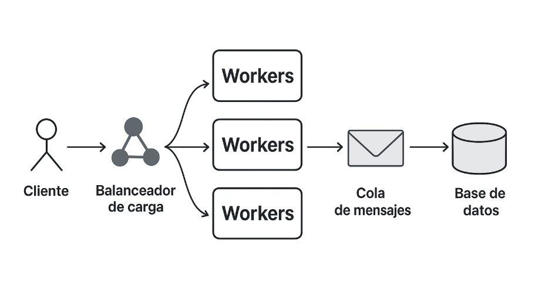

# María Eugenia Bava

## 1. Diseño de un Diagrama de un Sistema Distribuido

- Cliente Web/Móvil → capa de presentación.
- Balanceador de carga (Nginx/HAProxy) → distribuye peticiones a varios servidores.
- Workers (servidores) → ejecutan las tareas concurrentemente.
- Cola de mensajes (RabbitMQ) → coordina y distribuye tareas entre los workers.
- Almacenamiento (PostgreSQL / S3) → capa de persistencia de datos y resultados.

## 2. Implementación en Python
### Descripción general

Este proyecto implementa un sistema distribuido simple en Python que utiliza sockets para la comunicación entre un servidor y múltiples clientes.
El servidor distribuye tareas a 3 workers concurrentes, los cuales procesan las solicitudes (en este caso, contar la cantidad de letras de una palabra) y devuelven el resultado al cliente.
Además, las tareas procesadas se almacenan en una base de datos SQLite.

---

### Componentes

🖥️ server.py

Escucha conexiones entrantes.

Crea una cola compartida de tareas (queue.Queue).

Lanza 3 workers que procesan las palabras recibidas.

Guarda los resultados en una base de datos palabras.db.

💻 client.py

Simula 3 clientes conectados al mismo tiempo.

Cada cliente envía una palabra al servidor y recibe su resultado.

Se puede escribir "salir" para cerrar la conexión de cada cliente.

---

### Ejecución paso a paso

1️⃣ Iniciar el servidor:

python server.py

2️⃣ Ejecutar los clientes (en otra terminal):

python client.py

3️⃣ Interacción:

Cada cliente pedirá una palabra.

El servidor procesará las palabras y devolverá el resultado.

Las tareas quedarán registradas en palabras.db.

4️⃣ Finalizar:

Escribí salir para desconectar cada cliente.

Cuando todos los clientes cierren, podés detener el servidor (Ctrl + C).

---

### Tecnologías utilizadas

Python 3.x

socket (comunicación TCP)

threading (concurrencia)

queue (cola de tareas compartida)

sqlite3 (almacenamiento persistente)

